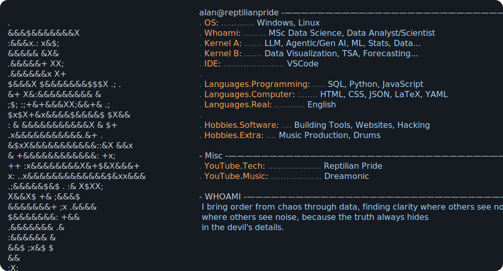

### 🧰 toolkit

<!-- Core -->

<!-- Data Stack -->

<!-- Machine Learning -->

<!-- Advanced AI -->

<!-- Systems -->

<!-- Visualization & Apps -->

---

### 📡 signal.log

• NLP systems → production forecasting & trend detection  
• ML systems → anomaly detection at scale  
• Data systems → observability + distributed pipelines  
• Focus → signal > noise in complex systems  

---

### 🌐 socials

---

<a href="https://github.com/ReptilianPride?tab=repositories">
  <picture>
    
  </picture>
</a>
